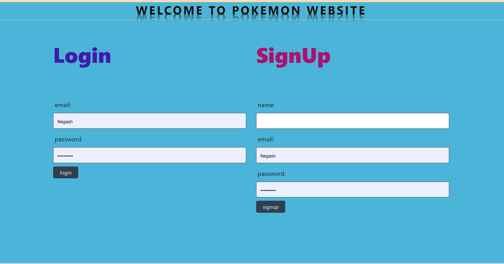

# Pokeman project

# Introduction
This project is done for the fullfillement of fullstack development online course in bootscamp. This is project 2 and comprises of handlebars, css, javascript, mysql, express and other dependencies. Anyone who wants to modify and improve the website is allowed to do so.

# Title: Project 2-Simply-Pokeman
This project is a collaborative project that was inspired by the idea of gathering pokeman pictures. This project allows users to search the name of a pokeman of interest and get a quick data return using information from google. It is easy to use, and is straight to the point. The webpage contains one page where the information loads and is displayed. 

## Developer Features 
The webpage contains all the base codes of handlebars, CSS, and Javascript. The handlebars was created to have a clean, straight-forward appeal. The user enters the webpage to see a search box where they can enter a pokeman title. The data that is being pulled is coming from two separate APIs, pokeman. When the search button is clicked, the data will be displayed on the screen. To call that data, you will notice that the Javascript code contains two fetch functions that request the json information from those websites. After those requests are made, an additional function was created for each request that will allow the information to be applied to separate divs that are connected to the handlebars. The information will be displayed in the respective sections, which will be loaded on the page. Users will then have the opportunity to read the information pulled, or they may enter a new pokeman title which will start that same series of events over again. 

## How to Install and Run the Project 
To use this project, you will need your own github account. Once you have signed up, you can click on the green "Code" button. This will display options for how you can either copy and paste the urls into your terminal or download a zip file. If you download a zip file you will want to save it in a secure spot on your local computer. From there, you will be able to open the file using your own account. You should already have created a repo that you will paste the files into. When you have the codes pulled up on VS code, you can customize the titles in the handlebars to match your website idea. When you are done customizing the code to fit your needs, you will want to push your changes to github. Then log back onto github to deploy your website. 

## Contributors 
Liam Andell, Kate Smallwood, Sandeep Meegahapola, and Negash Tseganeh. 

## License 
Please refer to the LICENSE in the repo. This project is licensed under the MIT License.

# Acknowledgments
We want to acknolwdege the online public PokémonApi provided by the team .

# Contact
For questions or feedback, please contact: liam@gmail.com, kates@gmail.com,sandeep@gmail.com, negash@gmail.com.

This is an interseting website.

## Screenshot

#Heroku url
https://obscure-hamlet-44623-4df518b27a8e.herokuapp.com/login

